# Flux App — Architecture

## Component & dependency map

```mermaid
graph TD
    subgraph sdk["CHIP SDK (native .so / JNI)"]
        CHIP["ChipDeviceController\n± AndroidChipPlatform"]
    end

    subgraph stub["chip-stub (compile-only)"]
        Stub["Stub classes for IDE &\nCI builds without .aar\n(throws at runtime)"]
    end

    subgraph kotlin["Android — Kotlin"]
        ChipClient["ChipClient\nsingleton SDK wrapper"]
        subgraph clusters["chip/clusters/"]
            ClusterClient["ClusterClient\nfacade over 12 clusters"]
            SubMgr["SubscriptionManager\n22 subscribed attr paths\n(sensor + actuator clusters)"]
        end
        Commissioner["MatterCommissioner\nBLE / IP commissioning\nCREDENTIALS_NEEDED rendezvous"]
        OtaMgr["OtaManager\nOTAProviderDelegate"]
        BleConn["BleConnectionManager"]
        NetDiag["NetworkDiagnosticsRunner"]
        Bridge["MatterBridge\norchestrates all native ops"]
        Main["MainActivity\nMethodChannel router\nEventChannel setup"]
    end

    subgraph channels["Flutter Platform Channels"]
        MCh["MethodChannel\ncom.fluxhome.app/matter"]
        ECh1["EventChannel\ndevice_state\n⚠ subscriptions + OTA mixed"]
        ECh2["EventChannel\ncommission_events"]
    end

    subgraph dart_svc["Dart — Services"]
        Port["matter_port.dart\nMatterPort interface\n(4 sub-interfaces)\nno UI imports"]
        MChan["MatterChannel\nimplements MatterPort\ndecodes raw map → DeviceStateEvent"]
        DCL["DclService\nDCL HTTP firmware queries"]
        ThreadSvc["ThreadSettingsService\nSharedPreferences"]
        QrSvc["QrPayloadService\nSharedPreferences"]
        DevStore["DeviceStore\nSharedPreferences\ndevice list persistence"]
        ClusterParser["cluster_parser.dart\nparseClusters / liveReadings\nstring-key renderers"]
    end

    subgraph dart_state["Dart — State / Models"]
        DevStateEvent["DeviceStateEvent (sealed)\nSubscriptionEstablishedEvent\nSubscriptionUpdateEvent\nSubscriptionResubscribingEvent\nSubscriptionErrorEvent\nOtaProgressEvent"]
        DevProv["DeviceProvider ⚠\n621 LOC — 7 concern clusters\n(commissioning extracted)"]
        CommCtrl["CommissioningController\nfull commission flow:\npayload · BLE · credentials\nname · log · persist callback"]
        LiveData["DeviceLiveData\nattrs map + typed getters\nsentinel stripping"]
        Snapshot["PersistedSnapshot\nlast-known live state"]
        DevModel["MatterDevice\npersisted device record"]
        DevView["DeviceView\nDevice + LiveData composite"]
        OtaProg["OtaProgressState"]
    end

    subgraph ui["Dart — UI"]
        Home["HomeScreen"]
        CommScr["CommissionScreen"]
        DevSettings["DeviceSettingsScreen\nidentify · share · OTA"]
        DevDetail["DeviceDetailScreen"]
        ThreadDiag["ThreadDiagScreen"]
        NetCheck["NetworkCheckScreen"]
        ClusterInsp["ClusterInspectorScreen"]
        Settings["SettingsScreen"]
    end

    %% Native → Kotlin
    CHIP -->|JNI| ChipClient
    Stub -. "replaces .aar\nin stub builds" .-> ChipClient
    ChipClient --> ClusterClient
    ChipClient --> SubMgr
    ChipClient --> Commissioner
    ChipClient --> OtaMgr
    Commissioner --> BleConn

    %% Kotlin internals → Bridge
    ClusterClient --> Bridge
    SubMgr -->|"string-keyed attr map\n⚠ no schema"| Bridge
    Commissioner --> Bridge
    OtaMgr --> Bridge
    NetDiag --> Bridge
    Bridge --> Main

    %% Bridge → Channels
    Main -->|"method results"| MCh
    Main -->|"subscription + OTA events\n⚠ mixed concerns"| ECh1
    Main -->|"commission progress\nCREDENTIALS_NEEDED string"| ECh2

    %% Channels → MatterChannel → typed events
    MCh --> MChan
    ECh1 -->|"raw Map decoded at boundary"| MChan
    ECh2 --> MChan
    MChan -->|"Stream<DeviceStateEvent>"| DevStateEvent
    MChan -.->|implements| Port

    %% Services → Providers
    DevStateEvent -->|"pattern match"| DevProv
    MChan -->|"MatterCommissionPort"| CommCtrl
    DevStore --> DevProv
    DCL --> DevSettings
    ThreadSvc --> Settings
    QrSvc --> CommCtrl
    ClusterParser --> DevDetail
    ClusterParser --> ClusterInsp

    %% CommissioningController → DeviceProvider lifecycle callbacks
    CommCtrl -->|"beginCommissioning()\nregisterCommissionedDevice()\nfailCommissioning()"| DevProv

    %% Provider internals
    DevProv -->|owns| LiveData
    DevProv -->|owns| Snapshot
    DevProv -->|owns| OtaProg
    DevProv -->|persists via| DevStore
    DevProv -->|creates| DevModel
    DevProv -->|exposes| DevView

    %% UI → Providers/Services
    Home --> DevProv
    CommScr --> CommCtrl
    DevSettings --> DevProv
    DevSettings -->|"MatterFabricPort"| Port
    DevDetail --> DevProv
    ThreadDiag --> Port
    NetCheck --> Port
    ClusterInsp --> Port
    Settings --> ThreadSvc

    %% Colour coding
    style DevProv fill:#ffeaa7,stroke:#e17055
    style ECh1 fill:#fab1a0,stroke:#e17055
    style SubMgr fill:#fab1a0,stroke:#e17055
    style Commissioner fill:#fab1a0,stroke:#e17055
    style LiveData fill:#ffeaa7,stroke:#e17055
    style DevStateEvent fill:#d5f5e3,stroke:#27ae60
    style Stub fill:#dfe6e9,stroke:#636e72
```



### Legend

| Colour | Meaning |
|---|---|
| Red / orange | High-risk component — complex seam or mixed concerns |
| Yellow | Secondary friction — split ownership or sentinel logic |
| Green | Recently introduced — typed boundary |
| Grey | Build infrastructure only — throws at runtime |

---

## `chip-stub` module

The `android/chip-stub/` module is a compile-time substitute for the real
`CHIPController.aar`. Every stub method throws `ChipSdkStubException` at runtime.

**Why it exists:** the `.aar` is a 50 MB binary not committed to the repo. The
stub lets the IDE resolve symbols and lets CI do a Kotlin type-check without
the SDK present. `MatterBridge.requireChip()` gates every real call behind
`ChipClient.isAvailable`, so stub builds produce a graceful "SDK not loaded"
error instead of a crash.

**What it must mirror:** whenever `MatterBridge.kt` adds an import from
`chip.*` or `matter.*`, a matching stub class must be added to `chip-stub/`.
Currently stubbed: `ChipDeviceController`, `OnboardingPayloadParser`,
`QRCodeOnboardingPayloadGenerator`, `ManualOnboardingPayloadGenerator`,
`CommissioningFlow`, `TlvReader`, `TlvWriter`, and the `OTAProviderDelegate`
callback hierarchy.

---

## `DeviceStateEvent` sealed class

`lib/models/device_state_event.dart` is the typed boundary between the
platform channel and all Dart code above it.

```
EventChannel (raw Map<String,dynamic>)
  └─ MatterChannel.deviceStateUpdates     ← single decoding site
       └─ Stream<DeviceStateEvent>
            └─ DeviceProvider._onDeviceStateEvent(event)
                 └─ switch (event) { ... }  ← compiler-exhausted
```

The five subtypes and what they carry:

| Type | Key fields |
|---|---|
| `SubscriptionEstablishedEvent` | `nodeId` |
| `SubscriptionUpdateEvent` | `nodeId`, `attrs: Map<String,dynamic>` |
| `SubscriptionResubscribingEvent` | `nodeId`, `nextIntervalMs` |
| `SubscriptionErrorEvent` | `nodeId`, `message` |
| `OtaProgressEvent` | `nodeId`, `phase`, `progress?`, `message?` |

`SubscriptionUpdateEvent.attrs` stays as `Map<String, dynamic>` intentionally:
the subscription attribute set is open-ended (new clusters add new keys without
code changes), and `DeviceLiveData`'s typed getters are the stable API over it.
The untyped contract is now contained to that one field rather than the entire
event stream.

---

## `DeviceProvider` responsibility breakdown

`DeviceProvider` currently owns 7 distinct concern clusters in ~1,016 LOC
(down from 8; commissioning logic moved to `CommissioningController`).

| Concern | Methods | Notes |
|---|---|---|
| **Persistence** | `_load`, `_persist`, `_flushSnapshot` | Delegated to `DeviceStore`; provider glues it |
| **Subscription lifecycle** | `_startAllSubscriptions`, `_startSubscription`, `_stopSubscription`, `_onDeviceStateEvent` | Natural extraction candidate |
| **Live state cache** | `_liveCache`, `_mergeLiveCache`, `updateBasicInfo`, `clusterCacheFor`, `cacheClusterJson` | Would move with the subscription extraction |
| **Device-type inference** | `_inferTypeFromEvent`, `_resolveUnknownDeviceType`, `_applyStateUpdate` | Three writers, no single authority (see friction #4) |
| **Commission lifecycle** | `beginCommissioning`, `registerCommissionedDevice`, `failCommissioning` | Thin callbacks only — logic lives in `CommissioningController` |
| **Device controls** | `toggle`, `setBrightness`, `coveringUp/Down/Stop`, `setFanMode/Percent`, `setColorTemperature` | Pure command dispatch; no state |
| **Device management** | `renameDevice`, `removeDevice`, `clearAllDevices`, `shareWithGoogleHome`, `refreshDevice`, `refreshAll` | Admin + one-shot reads |
| **Rooms** | `_rooms`, `createRoom`, `renameRoom`, `deleteRoom`, `assignRoom`, `_persistRooms` | CRUD over an in-memory room list |
| **Automation rules** | `_rules`, `_lastSwitchPressTime`, `upsertRule`, `removeRule`, switch-press matching | Rule storage + matching inline |
| **OTA progress** | `_otaProgress`, `clearOtaProgress`, OTA event handling | Progress map fed by `OtaProgressEvent`s |

> **A previous attempt** to split these into per-domain managers
> (`SubscriptionManager`, `DeviceControlService`, `RoomManager`,
> `RoomProvider`, `OtaProvider`, `AutomationProvider`) left half-extracted
> Dart files that were never wired into `main.dart`. Those files were
> deleted in May 2026; see the `refactor: delete dead ...` commits in
> `git log` for the previous shape if the split is revived. Any future
> attempt must update `main.dart`, all call sites, and the architecture
> doc in the same change — not leave parallel copies in the tree.

---

## Key data flows

### 1. Subscription update → UI

```
Device (Matter over Thread/WiFi)
  └─ CHIP SDK subscription (minInterval 1 s, maxInterval 120 s)
       └─ SubscriptionManager.extractAttrs()          [Kotlin, string-keyed map]
            └─ MatterBridge.emitDeviceState()          [posts to main thread]
                 └─ EventChannel device_state          [platform channel]
                      └─ MatterChannel: raw map decoded to DeviceStateEvent
                           └─ Stream<DeviceStateEvent>
                                └─ DeviceProvider._onDeviceStateEvent()
                                     ├─ SubscriptionUpdateEvent  → _applyStateUpdate() → DeviceLiveData.merge()
                                     ├─ SubscriptionEstablishedEvent → cancel fallback timer, flush snapshot
                                     ├─ SubscriptionResubscribing/ErrorEvent → markStale()
                                     └─ OtaProgressEvent → OtaProgressState update
                                          └─ notifyListeners() → DeviceView rebuilt → UI redraws
```

The string-keyed map still crosses the Kotlin→channel boundary without a schema.
The risk is now contained: a key typo produces a silent `null` in `DeviceLiveData`'s
typed getters but cannot corrupt the event dispatch.

### 2. Commissioning (BLE path)

```
QrScannerScreen captures "MT:…" payload
  └─ CommissioningController.setPayload() → _port.parsePayload() [CHIP SDK]
       └─ CommissioningController.start(config)
            ├─ requestBlePermissions() callback
            ├─ onNeedsCredentials() callback  (pre-collect if needed)
            ├─ _provider.beginCommissioning()  [loading state for HomeScreen]
            ├─ _port.commissionDevice()        [MatterCommissionPort — direct call]
            │    └─ MatterBridge → MatterCommissioner
            │         ├─ BleConnectionManager: scan → GATT connect
            │         ├─ ChipDeviceController.pairDeviceThroughBLE()
            │         │    ├─ onReadCommissioningInfo()
            │         │    │    └─ [may emit CREDENTIALS_NEEDED → suspend]
            │         │    │         └─ onNeedsCredentials() callback in CommissioningController
            │         │    │              └─ _port.provideCredentials() [resumes suspended coroutine]
            │         │    └─ onCommissioningComplete()
            │         └─ readPrimaryDeviceType()
            ├─ on success: _provider.registerCommissionedDevice(result, name, networkType)
            │    └─ creates MatterDevice, persists, refreshDevice(), _startSubscription()
            └─ on failure: _provider.failCommissioning(error)
```

The `CREDENTIALS_NEEDED` step is a distributed two-phase handshake: the Kotlin
coroutine suspends on a `CompletableDeferred` while Flutter calls back via
`provideCredentials()`. `runBlocking` holds the JNI thread during this window
(see friction #3).

### 3. OTA firmware update

```
DeviceSettingsScreen triggers _OtaSection._startFlash()
  └─ MatterChannel.downloadAndFlash()                  [platform call]
       └─ MatterBridge.downloadAndFlash()
            ├─ HTTP download of .bin to app cache dir
            ├─ OtaManager.configure()
            ├─ ChipDeviceController.startOTAProvider(otaManager)
            └─ ClusterClient.announceOtaProvider()
                 └─ Device queries OtaManager (BDX protocol)
                      ├─ handleQueryImage() → UpdateAvailable
                      ├─ handleBDXQuery() × N
                      ├─ handleApplyUpdateRequest() → Proceed / Discontinue
                      └─ handleNotifyUpdateApplied()

Progress arrives as OtaProgressEvent via the shared ECh1 / device_state channel.
DeviceProvider._onDeviceStateEvent() routes it to OtaProgressState — now via
the typed sealed class rather than a string type check.
```

---

## How to add a new sensor cluster

**Adding a cluster that arrives via the subscription stream (live updates):**

1. **`SubscriptionManager.kt`** — add the attribute path to `buildPaths()` and
   a decode line in `extractAttrs()`. Choose a camelCase key, e.g. `"myAttr"`.
2. **`DeviceLiveData`** — add a typed getter that reads the new key from
   `attrs` and strips any sentinel values.
3. **`cluster_parser.dart`** — add one entry to `_kLiveRenderers` and one
   `_render*` function. *Nothing else in Dart needs to change.*

**Adding a cluster that only appears in a one-shot read (not subscribed):**

1. **`cluster_parser.dart`** — add a `case 0xXXXX:` block to
   `_readingFromCluster()`. The function is self-contained.

---

## Friction points

| # | Seam | Risk | Status |
|---|---|---|---|
| 1 | `SubscriptionManager` → `DeviceLiveData` string-key contract | Key typo produces silent `null`; ~6 files to touch for one new attribute | Partially mitigated — event dispatch is now typed; `SubscriptionUpdateEvent.attrs` map is intentionally open-ended |
| 2 | Thermostat sentinel chain (`null` / `0x8000` / `Int.MIN_VALUE` / `-32768`) | Three null representations across 5 files | Mitigated — bridge now passes all 13 fields; chain is documented and contained |
| 3 | `CREDENTIALS_NEEDED` rendezvous in `MatterCommissioner` | Distributed two-phase commit; `runBlocking` on JNI thread; zero tests | Open |
| 4 | Device type — three independent writers in `DeviceProvider` | Non-symmetric eligibility conditions; no single authority | Open |
| 5 | `matter_port.dart` UI screen imports | Interface file importing from UI layer | **Fixed** — all 8 UI imports removed |
| 6 | OTA progress multiplexed on `device_state` EventChannel | Unrelated lifecycles share one channel | Partially mitigated — `OtaProgressEvent` is a typed sealed-class case; channel sharing remains |
| 7 | `DeviceProvider` god object (1,016 LOC, ~10 concern clusters) | Commissioning extracted; subscription lifecycle, controls, rooms, automation, and OTA all remain bundled | Partially mitigated — commissioning concern removed. Earlier extraction attempts for subscription / rooms / OTA / automation produced unused parallel files and were deleted; future splits must wire through `main.dart` in the same change |
