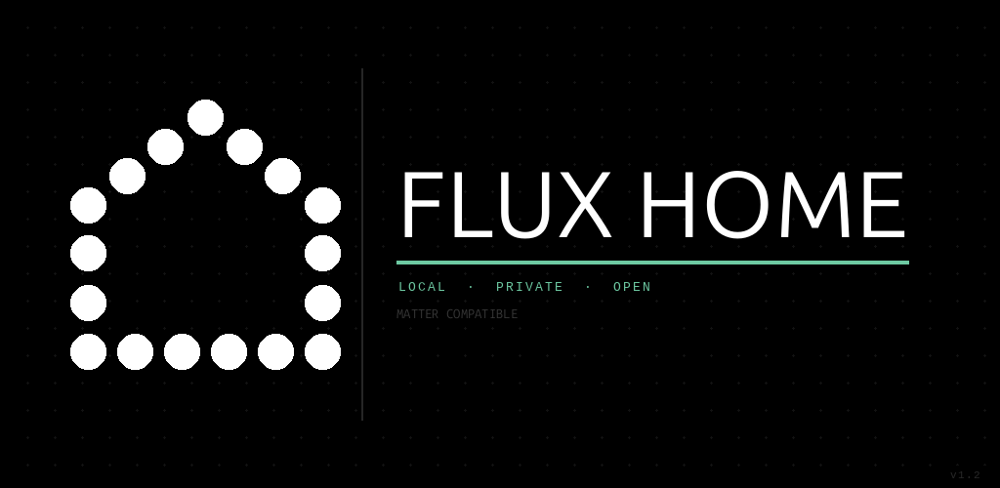

# Flux



A Flutter app for commissioning and controlling real Matter devices on Android.
Uses the connectedhomeip (CHIP) SDK directly — no Google Home SDK required.

## What it does

- Commission Thread and Wi-Fi Matter devices via BLE (QR code or manual pairing code) or IP
- Control On/Off, dimming, and thermostat (arc dial, mode selector, live temperature)
- Live sensor readings from all clusters (temperature, humidity, battery, air quality, etc.)
- OTA firmware updates via Matter BDX protocol with DCL version lookup
- Cluster Inspector: wildcard-reads all attributes/commands/feature-maps from all endpoints
- Thread network browser: discovers border routers via mDNS, imports credentials from Android
- Persists commissioned devices across restarts (no cloud dependency)

---

## Supported device types

Flux recognises all device types defined through Matter 1.5. The table below lists every
standardised type organised by category. ✅ = fully supported in the current build.

### Lighting
| Device type | Matter ID | Flux |
|---|---|---|
| On/Off Light | 0x0100 | ✅ |
| Dimmable Light | 0x0101 | ✅ |
| Color Temperature Light | 0x010C | ✅ |
| Extended Color Light | 0x010D | ✅ |

### Switches
| Device type | Matter ID | Flux |
|---|---|---|
| On/Off Switch | 0x0103 | ✅ |
| Dimmer Switch | 0x0104 | ✅ |
| Generic Switch | 0x000F | ✅ |
| Color Dimmer Switch | 0x0105 | — |

### Smart Plugs & Energy
| Device type | Matter ID | Flux |
|---|---|---|
| On/Off Plug-in Unit | 0x010A | ✅ |
| Dimmable Plug-in Unit | 0x010B | — |
| EV Charger | 0x050C | — |
| Water Heater | 0x050F | — |
| Device Energy Management | 0x050D | — |
| Electrical Sensor | 0x0510 | — |
| Solar Power | 0x0017 | — |
| Battery Storage | 0x0018 | — |

### HVAC
| Device type | Matter ID | Flux |
|---|---|---|
| Thermostat | 0x0301 | ✅ |
| Fan | 0x002B | ✅ |
| Air Purifier | 0x002D | ✅ |
| Room Air Conditioner | 0x0072 | — |
| Heat Pump | 0x0309 | — |
| Dehumidifier | 0x0077 | — |

### Sensors
| Device type | Matter ID | Flux |
|---|---|---|
| Temperature Sensor | 0x0302 | ✅ |
| Humidity Sensor | 0x0307 | ✅ |
| Pressure Sensor | 0x0305 | ✅ |
| Flow Sensor | 0x0306 | ✅ |
| Light Sensor | 0x0106 | ✅ |
| Occupancy Sensor | 0x0107 | ✅ |
| Contact Sensor | 0x0015 | ✅ |
| Smoke / CO Alarm | 0x0076 | ✅ |
| Air Quality Sensor | 0x0073 | ✅ |
| Water Leak Detector | 0x0043 | — |
| Water Freeze Detector | 0x0041 | — |
| Rain Sensor | 0x0044 | — |

### Access Control & Closures
| Device type | Matter ID | Flux |
|---|---|---|
| Door Lock | 0x000A | ✅ |
| Window Covering | 0x0202 | ✅ |
| Valve | 0x0042 | — |
| Pump | 0x0303 | — |

### Robotic & Appliances
| Device type | Matter ID | Flux |
|---|---|---|
| Robotic Vacuum Cleaner | 0x0074 | ✅ |
| Laundry Washer | 0x0073 | — |
| Laundry Dryer | 0x007C | — |
| Dishwasher | 0x0075 | — |
| Refrigerator | 0x0070 | — |
| Oven | 0x007B | — |
| Cooktop | 0x0078 | — |
| Microwave Oven | 0x0079 | — |
| Extractor Hood | 0x007A | — |

---

## Prerequisites

| Tool | Version |
|------|---------|
| Flutter | 3.x (stable) |
| Java | 17 |
| Android SDK | API 36 (compile), API 27 (min) |
| NDK | 28.2.13676358 |

The real CHIP SDK AAR (`CHIPController.aar`, ~31 MB) is **not bundled** in this repository.
Obtain it by running the helper script:

```bash
bash android/get_chip_sdk.sh
```

Or place it manually at:

```
android/app/libs/CHIPController.aar
```

Build it from [connectedhomeip](https://github.com/project-chip/connectedhomeip)
or copy from an existing CHIPTool build:

```
out/android-arm64-chip-tool/lib/src/controller/java/CHIPController.aar
```

Without the AAR the app compiles against `chip-stub` and all Matter calls return
`CHIP_SDK_UNAVAILABLE` at runtime.

---

## Build

```bash
export JAVA_HOME=/home/tado/workspace/jdk-17
export PATH=$JAVA_HOME/bin:$PATH
cd /home/tado/workspace/flux/app

flutter pub get
flutter build apk --release
# → build/app/outputs/flutter-apk/app-release.apk

# Install on WiFi-connected device
adb -s 192.168.1.123:5555 install -r build/app/outputs/flutter-apk/app-release.apk
```

---

## Legal notices

This project is licensed under the **Apache License 2.0** — see [`LICENSE`](LICENSE).
See [`NOTICE`](NOTICE) for third-party attributions.

**Trademarks**
- *Matter* is a trademark of the Connectivity Standards Alliance (CSA).
- *Thread* is a trademark of the Thread Group, Inc.
- Use of these names in this project is nominative/descriptive only. This project is not
  certified by, endorsed by, or affiliated with the CSA or the Thread Group.

**connectedhomeip (CHIP SDK)**
This app is built on top of [`project-chip/connectedhomeip`](https://github.com/project-chip/connectedhomeip),
licensed under Apache 2.0. The compiled AAR is not bundled in this repository;
use `android/get_chip_sdk.sh` to obtain it.

**CSA Distributed Compliance Ledger (DCL)**
The OTA update feature queries the public DCL REST API at `https://on.dcl.csa-iot.org`.
This is a CSA-operated service; its use is subject to CSA's terms.
