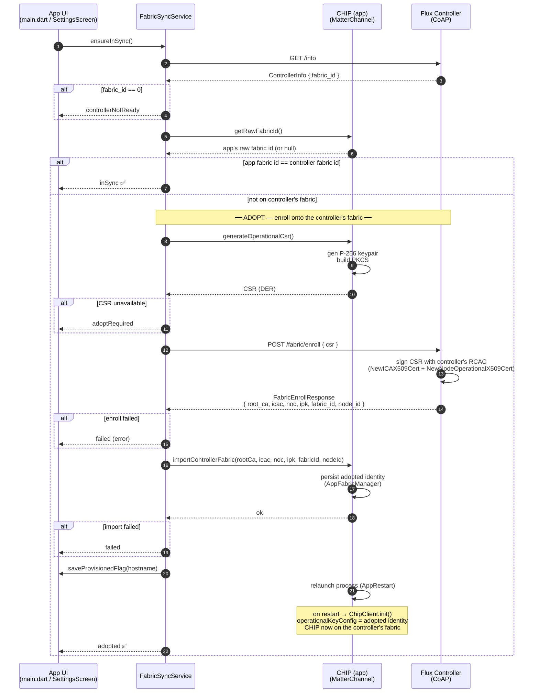

# Controller enrollment flow (joining the app to a controller's fabric)

> **Superseded — phone fabric enrollment was removed.** Device control is now
> fully controller-proxied (`POST /command` / `/write` / `/read` + `GET /events`),
> authenticated by the CoAP/DTLS PSK — the phone never needs Matter fabric
> membership to control a device, so `FabricSyncService` and this flow were
> deleted. See `docs/controller-only-control.md` for the current model. Kept
> below for history.

Sequence of calls when the app joins (enrolls onto) a Flux Controller's Matter
fabric. Driven by `FabricSyncService.ensureInSync()`
(`lib/services/fabric_sync_service.dart`), called on app startup (`main.dart`)
and from the controller settings screen.

## Notes

- The **controller owns the fabric** and acts as the CA. The app never seeds a
  fabric — it always enrolls (sends a CSR, the controller signs it) and
  imports the issued operational identity. See `multi-phone-fabric.md`.
- Membership is decided by comparing **raw** fabric ids (`getRawFabricId()`
  vs. `/info.fabric_id`), not the compressed fabric id.
- If the controller-issued chain fails to load, `ChipClient.init` clears the
  adopted identity and the app reverts to its local fabric — this path never
  bricks the app's CHIP identity.
